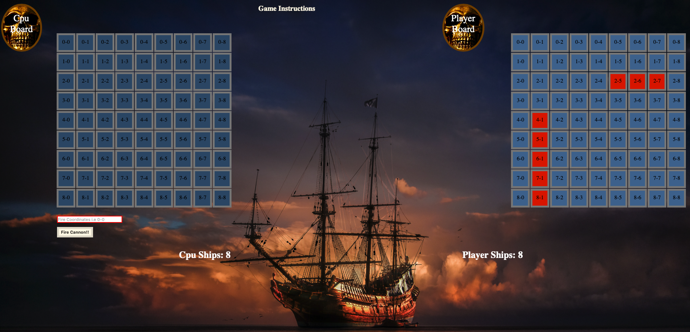
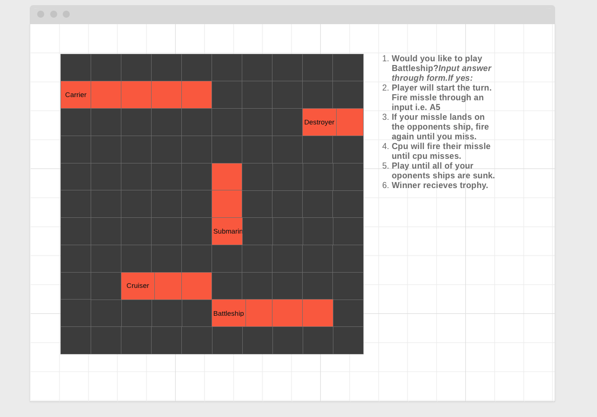
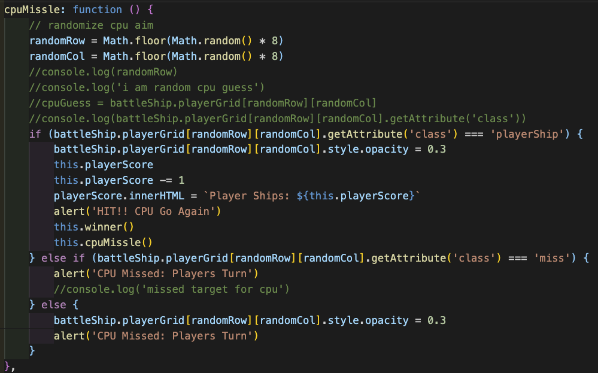
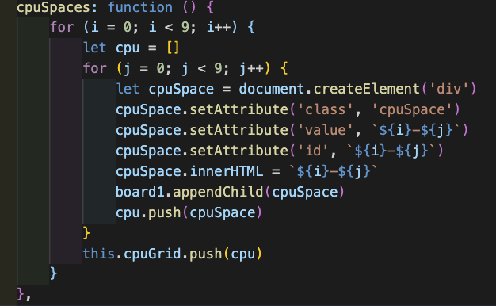

# Battleship

The game Battleship is a strategy type guessing game for two players, while this particular game I built includes a cpu.

## Motivation

My motivation for building Battleship is from my interest in strategy games. I enjoy problem solving while incorporating a cpu was interesting and challenging I felt the benefits from challenging and applying myself.

### An Image below indicates what to expect from my game

### I used a wireframe to help navigate my vision for what I would at least expect from my game.

A list of instructions will drop down once a player hovers their cursor over _Game Instructions_ on the top portion of the game screen. The player will start the turn. Selecting a pair of numbers within the cpu board will act as a guide for coordinates.The player is to insert these pair of numbers in a red input field and hit enter or click _Fire Cannon_. If the player selected coordinates with a hidden ship masked behind a representation of the ocean. The player is to select new coordinates until player misses. The cpu will have a chance to randomly select its own coordinates to sink the players ships when it is the cpu's turn upon player missing their target. Both player and cpu will play until their opponents ships are all sunk. Each player begins with 8 targets preselected. Winner will be declared when their oppenent is left with no more ships. Good Luck!!  

### Technologies & Code Snippets

This game emphasizes heavy use of Javascript, with styling from CSS and of course HTML for structure.

### Credits

I would like to thank luke-southern from unsplash.com for the images in this game and my good friend and classmate Danny McKinney for challenging me to think differently in how I approach solutions. As well as w3schools and MDN web docs for concise documentation.

### Future Development

The next steps for this project is to incorporate a smarter cpu along with randomized ship placement on behalf of the cpu as well as more user interaction with ship placement.
